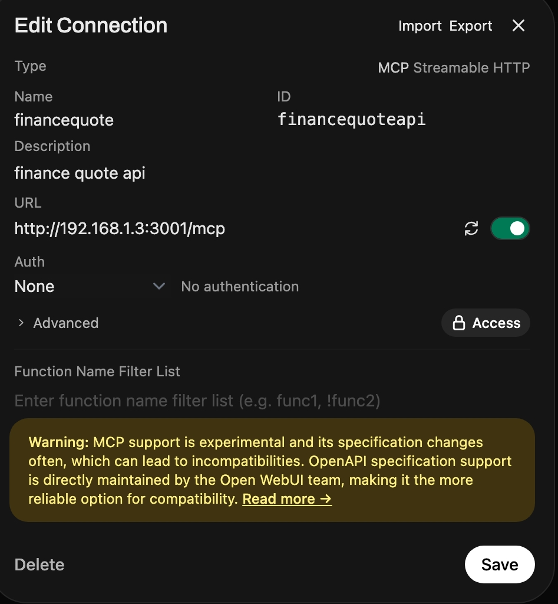
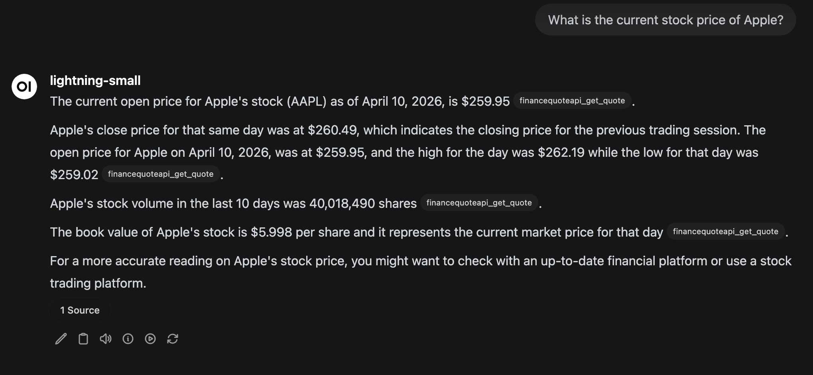

# FinanceQuote API

<p align="center">
  
  
  
  
  
</p>

> 📈 A production-ready REST API wrapper for the Perl Finance::Quote library — fetch stock quotes, currency rates, and financial data from 45+ global sources with a single HTTP request.

Universal financial data API - stocks, forex, crypto via 45+ providers - Docker Compose build and container.

- **REST API** — Simple HTTP endpoints for quotes, currency conversion, and more
- **MCP Protocol** — Built-in Model Context Protocol endpoint for AI agents and LLMs

Made with love and patience, your friend George.

## 🖥️ MCP Configuration

FinanceQuote provides a built-in MCP (Model Context Protocol) server that allows AI agents and LLM frontends to access financial data naturally. Below are configuration guides for popular MCP clients.

### OpenWebUI Integration

Connect FinanceQuote to OpenWebUI for natural language queries about stocks and currencies:

<p align="center">
  
</p>

<p align="center">
  
</p>

#### OpenWebUI MCP Configuration

1. Go to **Settings** → **Connections** → **MCP Servers**
2. Click **Add MCP Server**
3. Fill in the following:

| Setting | Value |
|---------|-------|
| **Name** | `FinanceQuote` |
| **URL** | `http://localhost:3001/mcp` |
| **Auth** | `None` (or Bearer token if `API_AUTH_KEYS` is set) |

4. Click **Connect** — you should see "FinanceQuote" listed as connected
5. Start chatting! Example prompts:
   - "What's the current price of AAPL?"
   - "Convert 100 USD to EUR"
   - "Get quotes for MSFT, GOOGL, and AMZN"

---

### LMStudio MCP Configuration

LMStudio supports MCP servers for local LLM inference with tool-calling capabilities.

#### Option 1: Using LMStudio's Built-in MCP UI

1. Open LMStudio and go to **Settings** → **MCP Servers**
2. Click **Add Server**
3. Configure as follows:

```
Server Name: FinanceQuote
Command: npx
Arguments: -y @modelcontextprotocol/server-http
Server URL: http://localhost:3001/mcp
```

4. Click **Connect** — the server should appear in your list of connected MCP servers

#### Option 2: Using SSE Transport (Recommended)

For more reliable connections, use the SSE (Server-Sent Events) transport:

1. In LMStudio's MCP settings, add a new server with:

```
Server Name: FinanceQuote
Command: node
Arguments: (leave empty - use URL below)
URL: http://localhost:3001/mcp/sse
```

2. Or configure via LMStudio's JSON config:

```json
{
  "mcpServers": {
    "financequote": {
      "url": "http://localhost:3001/mcp/sse"
    }
  }
}
```

#### Testing Your LMStudio Connection

1. Load a model with tool-calling enabled (e.g., Llama 3.1 with function calling)
2. Start a conversation and try:
   - "What's the stock price for Tesla?"
   - "Show me the EUR to GBP exchange rate"
   - "Get quotes for AAPL, MSFT, and NVDA"

---

### Other MCP Clients

For any other MCP-compatible client (Claude Desktop, Cursor, etc.):

#### SSE Transport (Recommended)

```
URL: http://localhost:3001/mcp/sse
```

#### HTTP Transport (Fallback)

```
URL: http://localhost:3001/mcp
```

#### Environment Variables for MCP

If using authentication, set the appropriate headers:

| Variable | Description |
|----------|-------------|
| `API_AUTH_KEYS` | Enable Bearer token auth |
| `MCP_AUTH_TOKEN` | Token to pass via Authorization header |

## ⚡ Quick Install (Copy & Deploy)

```bash
# One command to start
docker compose -f docker-compose.yaml up -d

# Or with custom configuration
docker compose -f docker-compose.yaml up -d -e FQ_CURRENCY=EUR -e API_AUTH_KEYS=mykey
```

The API runs on **http://localhost:3001** — test it immediately:
```bash
curl http://localhost:3001/api/v1/health
```

### Full docker-compose.yaml

<details>
<summary><strong>Click to expand - copy and customize</strong></summary>

```yaml
# Production-ready Docker Compose for FinanceQuote API
services:
  financequote-api:
    image: ghcr.io/gbozo/financequote-api:latest
    container_name: financequote-api
    environment:
      - APP_ENV=production
      - APP_PORT=3001
      - FQ_TIMEOUT=30
      # - FQ_CURRENCY=EUR        # Optional: set default currency
      # - API_AUTH_KEYS=key1     # Optional: enable auth
      # - ALPHAVANTAGE_API_KEY=   # Optional: premium quotes
    ports:
      - "3001:3000"
    restart: unless-stopped
    healthcheck:
      test: ["CMD", "curl", "-f", "http://localhost:3000/api/v1/health"]
      interval: 30s
      timeout: 10s
      retries: 3
    networks:
      - financequote-net

networks:
  financequote-net:
    driver: bridge
```

</details>

## ✨ Features

- 🚀 **45+ Data Sources** — Yahoo Finance, AlphaVantage, Twelve Data, European exchanges, and more
- 🌍 **Global Markets** — US, Europe, Asia, Australia, India, and more
- 💱 **Currency Conversion** — Real-time exchange rates from multiple providers
- 🤖 **MCP Protocol** — AI agent-ready endpoint for programmatic access
- 🔐 **Optional API Key Authentication** — Secure your API with Bearer token auth
- 🐳 **Docker-Ready** — Single command to spin up the entire stack
- 📚 **Interactive Documentation** — Built-in API explorer and tester
- 🌐 **Language Libraries** — Go, Python, and Node.js client libraries included

## 🎯 Quick Start

### Use the API

```bash
# Get a stock quote
curl "http://localhost:3001/api/v1/quote/AAPL"

# Get multiple quotes
curl "http://localhost:3001/api/v1/quote/AAPL,GOOGL,MSFT"

# List all available methods
curl "http://localhost:3001/api/v1/methods"

# Currency conversion
curl "http://localhost:3001/api/v1/currency/USD/EUR"
```

### Open Interactive Docs

Visit **http://localhost:3001** in your browser for:
- Complete API documentation
- Interactive API tester
- Code examples in curl, Python, Go, and JavaScript

## 📡 API Endpoints

| Endpoint | Description | Example |
|----------|-------------|---------|
| `GET /api/v1/quote/:symbols` | Fetch stock quotes | `/api/v1/quote/AAPL,MSFT` |
| `GET /api/v1/currency/:from/:to` | Currency conversion | `/api/v1/currency/USD/EUR` |
| `GET /api/v1/methods` | List available sources | — |
| `GET /api/v1/fetch/:method/:symbols` | Use specific source | `/api/v1/fetch/yahoojson/AAPL` |
| `GET /api/v1/health` | Health check | — |
| `POST /mcp` | MCP Protocol (JSON-RPC 2.0) | See MCP section below |

### MCP Protocol (for AI Agents)

The MCP endpoint (`POST /mcp`) allows AI agents and LLMs to access quote data via JSON-RPC 2.0:

```bash
# Initialize connection
curl -X POST http://localhost:3001/mcp \
  -H "Content-Type: application/json" \
  -d '{"jsonrpc":"2.0","id":1,"method":"initialize"}'

# List available tools
curl -X POST http://localhost:3001/mcp \
  -H "Content-Type: application/json" \
  -d '{"jsonrpc":"2.0","id":2,"method":"tools/list"}'

# Get a stock quote
curl -X POST http://localhost:3001/mcp \
  -H "Content-Type: application/json" \
  -d '{
    "jsonrpc":"2.0",
    "id":3,
    "method":"tools/call",
    "params":{
      "name":"get_quote",
      "arguments":{"symbols":"AAPL,MSFT"}
    }
  }'

# Get currency rate
curl -X POST http://localhost:3001/mcp \
  -H "Content-Type: application/json" \
  -d '{
    "jsonrpc":"2.0",
    "id":4,
    "method":"tools/call",
    "params":{
      "name":"get_currency",
      "arguments":{"from":"USD","to":"EUR"}
    }
  }'
```

**Available MCP Tools:**
- `get_quote` — Fetch stock/ETF quotes (params: symbols, method, currency)
- `get_currency` — Exchange rate conversion (params: from, to)
- `list_methods` — Show all available quote methods

### Query Parameters

| Parameter | Description | Default |
|-----------|-------------|---------|
| `method` | Quote source (yahoojson, alphavantage, etc.) | yahoojson |
| `currency` | Target currency for conversion | — |

## 📦 Available Quote Methods

| Method | Description | API Key Required |
|--------|-------------|------------------|
| `yahoojson` | Yahoo Finance (JSON) | ❌ No |
| `alphavantage` | Alpha Vantage | ✅ Yes |
| `twelvedata` | Twelve Data | ✅ Yes |
| `financeapi` | FinanceAPI | ✅ Yes |
| `asx` | Australian Securities Exchange | ❌ No |
| `aex` | Amsterdam Exchange | ❌ No |
| `nseindia` | National Stock Exchange India | ❌ No |
| `stooq` | Stooq (Poland) | ❌ No |
| + 40 more... | | |

## 🔐 Authentication

Enable API authentication by setting `API_AUTH_KEYS`:

```bash
# .env file
API_AUTH_KEYS=key1,key2,key3
```

```bash
# Using authenticated requests
curl -H "Authorization: Bearer key1" "http://localhost:3001/api/v1/quote/AAPL"
```

## 🛠️ Configuration

### Environment Variables

```bash
# API Authentication (comma-separated keys)
API_AUTH_KEYS=

# Stock Quote API Keys
ALPHAVANTAGE_API_KEY=
TWELVEDATA_API_KEY=
FINANCEAPI_API_KEY=
STOCKDATA_API_KEY=

# Currency API Keys
FIXER_API_KEY=
OPENEXCHANGE_API_KEY=
CURRENCYFREAKS_API_KEY=

# App Settings
APP_PORT=3001
FQ_TIMEOUT=30
```

## 📚 Client Libraries

Ready-to-use libraries for your favorite language:

### Go
```go
client := financequote.NewClient("http://localhost:3001", "api-key")
quote, _ := client.GetQuote("AAPL", nil)
```

### Python
```python
client = FinanceQuoteClient("http://localhost:3001", "api-key")
quote = client.get_quote("AAPL")
```

### Node.js
```javascript
const client = new FinanceQuoteClient('http://localhost:3001', 'api-key');
const quote = await client.getQuote('AAPL');
```

→ [View all libraries](libs/)

## 🐳 Docker Options

### Production (uses released image)
```bash
# Pull latest release and run
docker compose -f docker-compose.yaml up -d

# Or with custom port
APP_PORT=7000 docker compose -f docker-compose.yaml up -d
```

## 🤝 Contributing

Contributions are welcome! Please feel free to submit a Pull Request.

## 📄 License

MIT License — see [LICENSE](LICENSE) for details.

---

<div align="center">

**⭐ If this project helped you, please give it a star!**

Built with ❤️ using Perl, Plack, Python and Docker

</div>